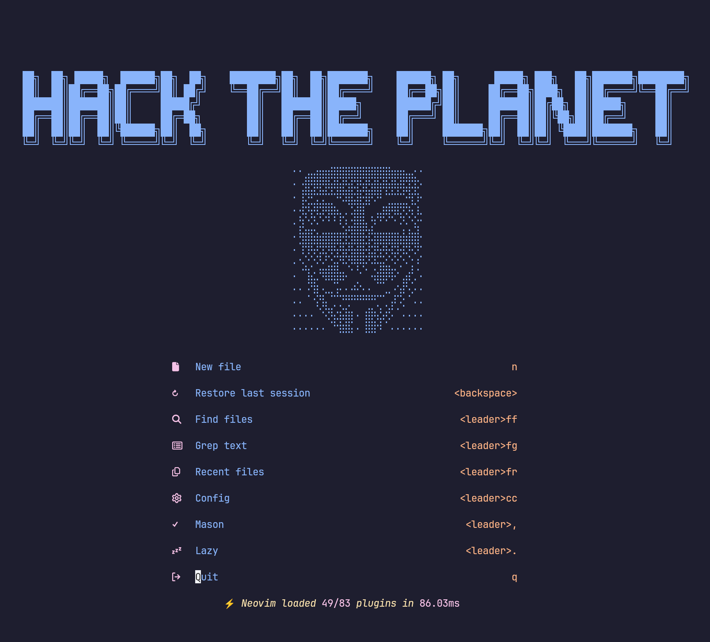

<h1>
  
</h1>

<a href="https://dotfyle.com/greggh/nvim"></a>
<a href="https://dotfyle.com/greggh/nvim"></a>
<a href="https://dotfyle.com/greggh/nvim"></a>



## ⚡️ Requirements

- [Nerd Font](https://www.nerdfonts.com/)
- [lazygit](https://github.com/jesseduffield/lazygit)
- [ripgrep](https://github.com/BurntSushi/ripgrep)
- [fd](https://github.com/sharkdp/fd)
- [fzf](https://github.comjunegunn/fzf)

## Install Instructions

 > **REQUIRES NEOVIM 0.10+**. This configuration uses several Neovim 0.10+ exclusive features including:
 > - `vim.system()` for async operations
 > - `splitkeep` option for better window management
 > - Updated LSP handlers and APIs
 > - Modern UI capabilities
 >
 > Always review the code before installing a configuration.

Clone the repository and install the plugins:

```sh
git clone git@github.com:greggh/nvim ~/.config/greggh/nvim
```

Open Neovim with this config:

```sh
NVIM_APPNAME=greggh/nvim/ nvim
```

## Contributing

Contributions are welcome! If you'd like to help improve this configuration:

1. Check the [open issues](https://github.com/greggh/nvim/issues) or create a new one to discuss your idea
2. Fork the repository
3. Create a new branch for your feature
4. Make your changes
5. Run the tests (`make test`) and ensure they pass
6. Submit a pull request

Please read [CONTRIBUTING.md](CONTRIBUTING.md) for detailed guidelines on how to contribute and [DEVELOPMENT.md](DEVELOPMENT.md) for development setup instructions.

## Development

This configuration includes a testing framework and development tools:

- **Testing**: Run `make test` to execute all tests
- **Linting**: Run `make lint` to check code quality
- **Formatting**: Run `make format` to format Lua code
- **Git Hooks**: Run `./scripts/setup-hooks.sh` to set up pre-commit hooks

For a complete development environment setup, see [DEVELOPMENT.md](DEVELOPMENT.md).

## 💤 Plugin manager

- [lazy.nvim](https://github.com/folke/lazy.nvim)

## 🔌 Plugins

- [actions-preview.nvim](https://github.com/aznhe21/actions-preview.nvim)
- [auto-save.nvim](https://github.com/okuuva/auto-save.nvim)
- [avante.nvim](https://github.com/yetone/avante.nvim)
- [blink-ripgrep.nvim](https://github.com/mikavilpas/blink-ripgrep.nvim)
- [blink.cmp](https://github.com/saghen/blink.cmp)
- [blink.compat](https://github.com/saghen/blink.compat)
- [boole.nvim](https://github.com/nat-418/boole.nvim)
- [catppuccin](https://github.com/catppuccin/nvim)
- [ccc](https://github.com/uga-rosa/ccc.nvim)
- [claude-code.nvim](https://github.com/greggh/claude-code.nvim)
- [cmp-cmdline-history](https://github.com/dmitmel/cmp-cmdline-history)
- [Comment.nvim](https://github.com/numToStr/Comment.nvim)
- [conform.nvim](https://github.com/stevearc/conform.nvim)
- [copilot.lua](https://github.com/zbirenbaum/copilot.lua)
- [depsync.nvim](https://github.com/robertazzopardi/depsync.nvim)
- [diffview.nvim](https://github.com/sindrets/diffview.nvim)
- [dressing.nvim](https://github.com/stevearc/dressing.nvim)
- [dropbar.nvim](https://github.com/Bekaboo/dropbar.nvim)
- [edgy.nvim](https://github.com/folke/edgy.nvim)
- [flash.nvim](https://github.com/folke/flash.nvim)
- [friendly-snippets](https://github.com/rafamadriz/friendly-snippets)
- [gitsigns.nvim](https://github.com/lewis6991/gitsigns.nvim)
- [grug-far.nvim](https://github.com/MagicDuck/grug-far.nvim)
- [hardtime.nvim](https://github.com/m4xshen/hardtime.nvim)
- [helpview.nvim](https://github.com/OXY2DEV/helpview.nvim)
- [highlight-undo.nvim](https://github.com/tzachar/highlight-undo.nvim)
- [img-clip.nvim](https://github.com/HakonHarnes/img-clip.nvim)
- [incline.nvim](https://github.com/b0o/incline.nvim)
- [iron.nvim](https://github.com/Vigemus/iron.nvim)
- [laravel-helper.nvim](https://github.com/greggh/laravel-helper.nvim)
- [lazy.nvim](https://github.com/folke/lazy.nvim)
- [lazydev.nvim](https://github.com/folke/lazydev.nvim)
- [lualine.nvim](https://github.com/nvim-lualine/lualine.nvim)
- [LuaSnip](https://github.com/L3MON4D3/LuaSnip)
- [markview.nvim](https://github.com/OXY2DEV/markview.nvim)
- [mason-lspconfig.nvim](https://github.com/williamboman/mason-lspconfig.nvim)
- [mason-tool-installer.nvim](https://github.com/WhoIsSethDaniel/mason-tool-installer.nvim)
- [mason.nvim](https://github.com/williamboman/mason.nvim)
- [mini.icons](https://github.com/echasnovski/mini.icons)
- [mini.sessions](https://github.com/echasnovski/mini.sessions)
- [mini.surround](https://github.com/echasnovski/mini.surround)
- [neotest-golang](https://github.com/fredrikaverpil/neotest-golang)
- [neotest-jest](https://github.com/nvim-neotest/neotest-jest)
- [neotest-pest](https://github.com/V13Axel/neotest-pest)
- [neotest-plenary](https://github.com/nvim-neotest/neotest-plenary)
- [neotest-python](https://github.com/nvim-neotest/neotest-python)
- [neotest-rust](https://github.com/rouge8/neotest-rust)
- [neotest-vitest](https://github.com/marilari88/neotest-vitest)
- [neotest](https://github.com/nvim-neotest/neotest)
- [noice.nvim](https://github.com/folke/noice.nvim)
- [nui.nvim](https://github.com/MunifTanjim/nui.nvim)
- [nvim-autopairs](https://github.com/windwp/nvim-autopairs)
- [nvim-dap-python](https://github.com/mfussenegger/nvim-dap-python)
- [nvim-dap-ui](https://github.com/rcarriga/nvim-dap-ui)
- [nvim-dap-virtual-text](https://github.com/theHamsta/nvim-dap-virtual-text)
- [nvim-dap](https://github.com/mfussenegger/nvim-dap)
- [nvim-lightbulb](https://github.com/kosayoda/nvim-lightbulb)
- [nvim-lint](https://github.com/mfussenegger/nvim-lint)
- [nvim-lspconfig](https://github.com/neovim/nvim-lspconfig)
- [nvim-nio](https://github.com/nvim-neotest/nvim-nio)
- [nvim-notify](https://github.com/rcarriga/nvim-notify)
- [nvim-treesitter-context](https://github.com/nvim-treesitter/nvim-treesitter-context)
- [nvim-treesitter-textobjects](https://github.com/nvim-treesitter/nvim-treesitter-textobjects)
- [nvim-treesitter](https://github.com/nvim-treesitter/nvim-treesitter)
- [nvim-ts-autotag](https://github.com/windwp/nvim-ts-autotag)
- [nvim-web-devicons](https://github.com/nvim-tree/nvim-web-devicons)
- [one-small-step-for-vimkind](https://github.com/jbyuki/one-small-step-for-vimkind)
- [outline.nvim](https://github.com/hedyhli/outline.nvim)
- [plenary.nvim](https://github.com/nvim-lua/plenary.nvim)
- [quicker.nvim](https://github.com/stevearc/quicker.nvim)
- [rainbow-delimiters.nvim](https://github.com/HiPhish/rainbow-delimiters.nvim)
- [screenkey.nvim](https://github.com/NStefan002/screenkey.nvim)
- [smart-splits.nvim](https://github.com/mrjones2014/smart-splits.nvim)
- [snacks.nvim](https://github.com/folke/snacks.nvim)
- [suda](https://github.com/lambdalisue/suda.vim)
- [symbol-usage.nvim](https://github.com/Wansmer/symbol-usage.nvim)
- [tide.nvim](https://github.com/jackMort/tide.nvim)
- [tiny-inline-diagnostic.nvim](https://github.com/rachartier/tiny-inline-diagnostic.nvim)
- [todo-comments.nvim](https://github.com/folke/todo-comments.nvim)
- [treewalker.nvim](https://github.com/aaronik/treewalker.nvim)
- [trouble.nvim](https://github.com/folke/trouble.nvim)
- [which-key.nvim](https://github.com/folke/which-key.nvim)
- [workspace-diagnostics.nvim](https://github.com/artemave/workspace-diagnostics.nvim)
- [yazi.nvim](https://github.com/mikavilpas/yazi.nvim)
